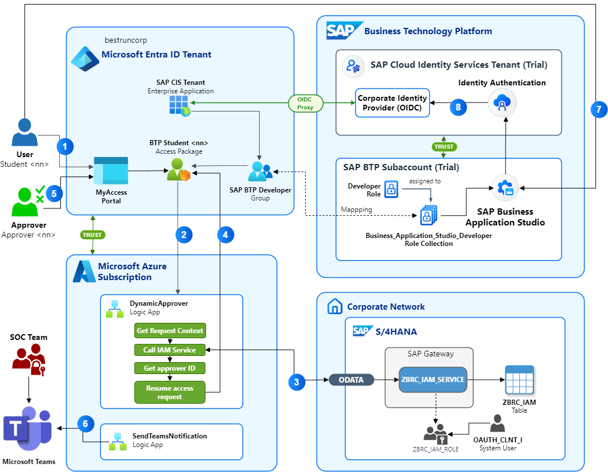

# Mastering the Migration: A technical Deep Dive into Moving from SAP Identity Management (IDM) to Microsoft Entra
## 1. Introduction
Welcome to the DSAG TechXChange 2025 Hands-on lab. This document provides an overview of the Hands-on activities, challenges, and resources available to participants.

In this hands-on session you will implement a comprehensive solution for providing users with access to sign-in to SAP applications. You'll learn how to integrate Microsoft Entra with SAP Cloud Identity Services and leverage Microsoft Entra's advanced features to migrate and modernize existing SAP IDM workflows, user self-service UIs, integration with SAP data sources, and much more.

## 2. Scenario overview
You will implement the following IDM scenario for BestRun Corp., our fictional company in this hands-on session:

1. The user (*user<41..70>@bestruncorp.onmicrosoft.com*) requires a developer role in BestRun's SAP BTP subaccount to develop BTP-based business applications. BestRun centralizes all identity and access management in their Microsoft Entra tenant (bestruncorp.onmicrosoft.com). BestRun has defined an Entra security group **SAP BTP Developer** which users can request access to via the self-service portal *MyAccess* by requesting the access package **BTP Student \<41..70\>**. Similar to [business roles](https://help.sap.com/docs/SAP_IDENTITY_MANAGEMENT/4773a9ae1296411a9d5c24873a8d418c/d09544573d834cde9b9ee1d6c3120dcf.html?q=Business+Role#business-roles) in SAP IDM, [access packages](https://learn.microsoft.com/en-us/entra/id-governance/entitlement-management-overview) in Entra are bundles of resources that provide users with the necessary access to work on projects or perform tasks. These packages are defined in containers called catalogs and allow for assigning roles to multiple resources at once, such as Entra security groups.
1. All requests to the **BTP Student** access package require an approval workflow. As a multi-national corporation, BestRun has business operations in many countries that are managed as seperate company codes in BestRun's SAP S/4 HANA system. Depending on the user's (requestor's) company code, a different approver is assigned in the system to approve (or deny) the access package request. To determine the approver based on the given context for each request, the access package calls a functional extension for the Entra ID Governance workflow, an [*Azure Logic App*](https://learn.microsoft.com/en-us/azure/logic-apps/logic-apps-overview).
1. The *DynamicApprover* Logic App takes the request from the access package and extracts the context information provided by the requestor, such as the *company code*. With these input parameters, it calls an OData service (*ZBRC_IAM_SERVICE*) exposed by BestRun's S/4 HANA system, that accesses a table (*ZBRC_IAM*) which is used to maintain the assignment of approvers to BestRun's business roles in the context of the requestor's company code.
1. The Logic App resumes the access package request workflow and assignes the approval task to the responsible approver returned by the OData service.
1. The approver (*approver<41..70>@bestruncorp.onmicrosoft.com*) logs in to the *MyAcces* self-service portal and approves the request for the *BTP Student \<41..70\>* access package. This assigns the resources defined in the access package to the user (requestor). In this scenario, the user is now assigned to the *SAP BTP Developer* security group.
1. As an *optional* implementation step in this hands-on, you can trigger a notification to a Microsoft Teams channel that informs BestRun's Security Operations Center (SOC) team about this security event (i.e. assignemnt or removal of a new privileged group to a user).
1. Now the user can access the [SAP Business Application Studio](https://www.sap.com/germany/products/technology-platform/business-application-studio.html). This requires assignment of the BTP role collection *Business_Application_Studio_Developer* to the user, which is realized by mapping the role collection to the Entra *SAP BTP Developer* security group. 
1. Login to SAP Business Application Studio is delegated to BestRun's SAP Cloud Identity Services Authentication Service (IAS) tenant, which in turn forwards as an *OpenID Connect (OIDC) proxy* all authentication requests to BestRun's corporate Identity Provider, BestRun's Entra tenant. Here, BestRun's IAS tenant is registered as an Enterprise Application with the required configuration to emit the user's group membership(s) in Entra in the OAuth access token returned to IAS. From there, the *SAP BTP Developer* group membership is propagated to SAP Business Application Studio, which can successfully authorize the user as a member of the *Business_Application_Studio_Developer* role collection.

## 3. Let's get started!
> [!IMPORTANT]
> Choose your user account for the requestor and approver in the scenario. Please follow the instructor's guidance to pick a number from 41 to 70. This ensures that that your work does not interfere with another student's work in the session. Let's say you are assinged to number *50*: Please use the accounts **user50@bestruncorp.onmicrosoft.com* for logging in as the requestor, and *approver50@bestruncorp.onmicrosoft.com* as the approver in the scenario. You will receive the password for the accounts from the instructor.

This hands-on session implements a complete end-to-end IAM workflow scenario with the following 6 (optionally 7) exercises:
1. [Testing access to SAP BTP before requesting the access package](./ex1/ex1.md)
1. [Create the access package for SAP BTP Developers in Entra ID Governance](./ex2/ex2.md)
1. [Configure the access package assignment policy with the Microsoft Graph API](./ex3/ex3.md)
1. [Test the new dynamic approval workflow](./ex4/ex4.md)
1. [Approve the access package request](./ex5/ex5.md)
1. [Test access to SAP Business Application Studio](./ex6/ex6.md)
1. [(*Optional*) Inform the SOC team via Microsoft Teams](./ex7/ex7.md)

You have your number assigned? Great, then let's dive into [exercise 1](./ex1/ex1.md).
