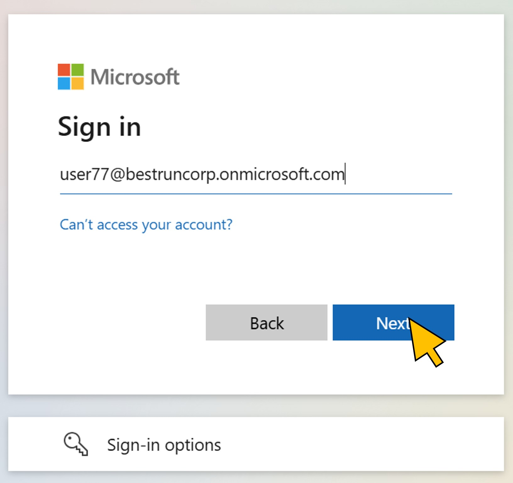
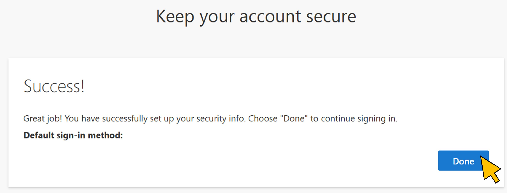
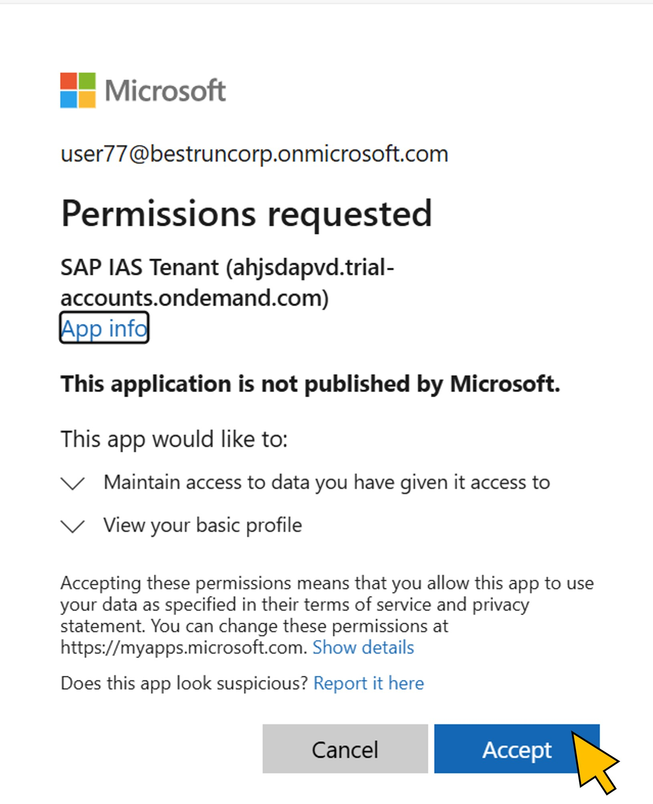
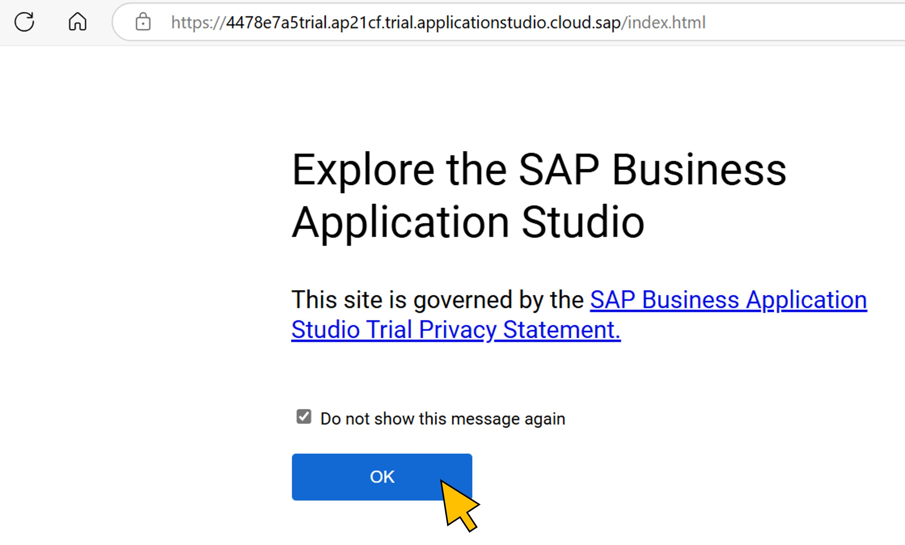
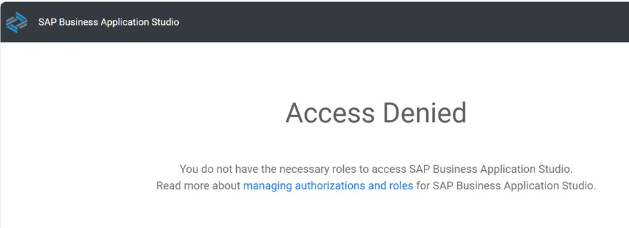

# Exercise 1: Testing access to SAP BTP before requesting the access package
In this first exercise you login with your student's user account to SAP Business Application Studio. As expeczed, access will be denied because your user is not yet assigned to the *SAP BTP Developer* group in Entra.

| Step   | Description                | Screenshot |
| :----- | :------------------------- | :--------- |
| 1.1    |Start a new web browser window and open **SAP Business Application Studio** at ```https://4478e7a5trial.ap21cf.trial.applicationstudio.cloud.sap/```.<br><br>SAP IAS proxies the login request to Microsoft Entra, where you login with user\<41..80\>@bestruncorp.onmicrosoft.com.      |<a href="./img/1-1.jpg" target="_blank"></a>|
| 1.2    |Enter the password and click **Sign-in**.|<a href="./img/1-2.jpg" target="_blank"></a>|
| 1.3    |Click **Next**.|<a href="./img/1-3.jpg" target="_blank"></a>|
| 1.4    |Click **Done**.|<a href="./img/1-4.jpg" target="_blank"></a>|
| 1.5    |Click **Yes**.|<a href="./img/1-5.jpg" target="_blank"></a>|
| 1.6    |Provide your user consent to allow SAP IAS tenant to request your basic user profile data by clicking **Accept**.|<a href="./img/1-6.jpg" target="_blank"></a>|
| 1.7    |Activate the checkbox on the welcome screen of *SAP Business Application Studio* and click **OK**.|<a href="./img/1-7.jpg" target="_blank"></a>|
| 1.8    |Because your user is not assigned to the requires group in Microsoft Entra, SAP Business Application Studio cannot find any of the required roles and denies access.|<a href="./img/1-8.jpg" target="_blank"></a>|

Continue with [exercise 2](../ex2/ex2.md), or go back to the [overview](../README.md).