# Exercise 2: Create the access package for SAP BTP Developers in Entra ID Governance
To request assignment to the *SAP BTP Developer* group, an access package is created in this exercise. You will use the Microsoft Entra admin center for this task.
The steps in this exercise will only create the basic setup. In the next [exercise](../ex3/ex3.md), you will use the Microsoft Graph API to configure further settings on the access package, such as the approval workflow for the scenario. 

| Step   | Description     | Screenshot          |
| :----- | :-------------- | :-----------------: |
| 2.1    |Sign-in to [Microsoft Entra admin center](https://aka.ms/EMApprovalExtensibility) with your user user\<41..70\> @bestruncorp.onmicrosoft.com. ||
| 2.2    |Click **Next**.|<a href="./img/2-2.jpg" target="_blank">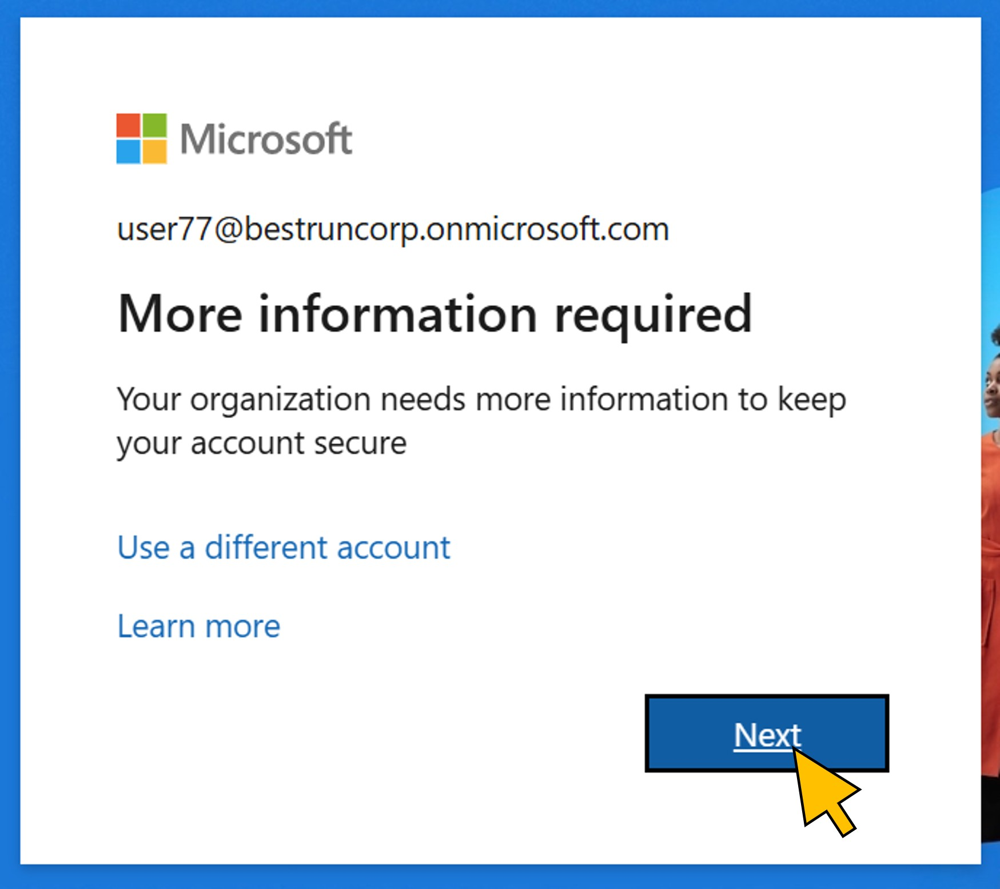</a>|
| 2.3    |Confirm with **Done**.|<a href="./img/2-3.jpg" target="_blank">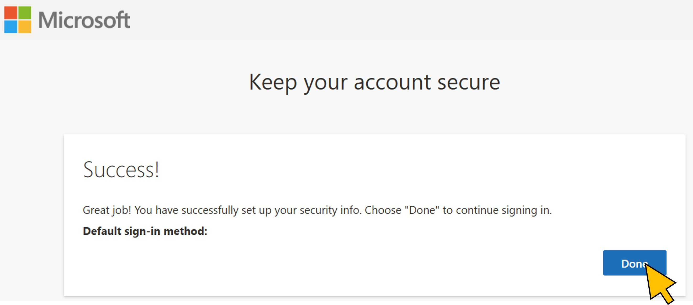</a>|
| 2.4    |Select **Catalogs** from the navigation menu. In the search bar, enter your *Student*-number. Select the catalog **Student\<41..80\>** with the number assigned to you from the list.|<a href="./img/2-4.jpg" target="_blank">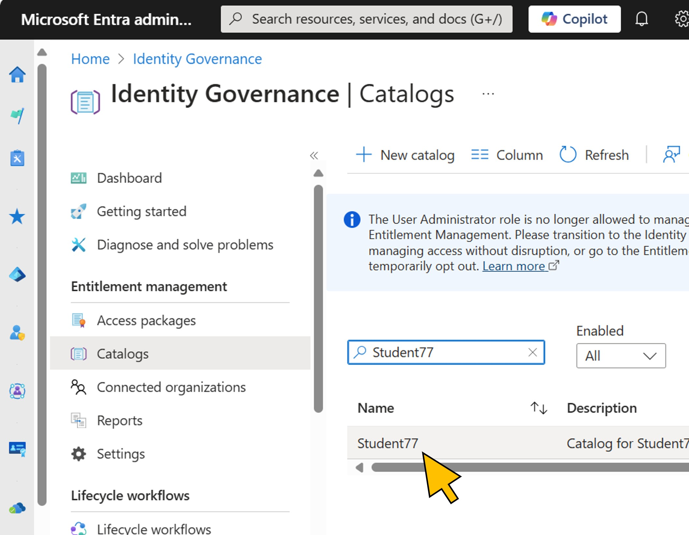</a>|
| 2.5    |From the **Overview** page, mark the **Object Id** value, **right-click** on it, and click **Copy** from the context menu to copy the Id to the clipboard.|<a href="./img/2-5.jpg" target="_blank">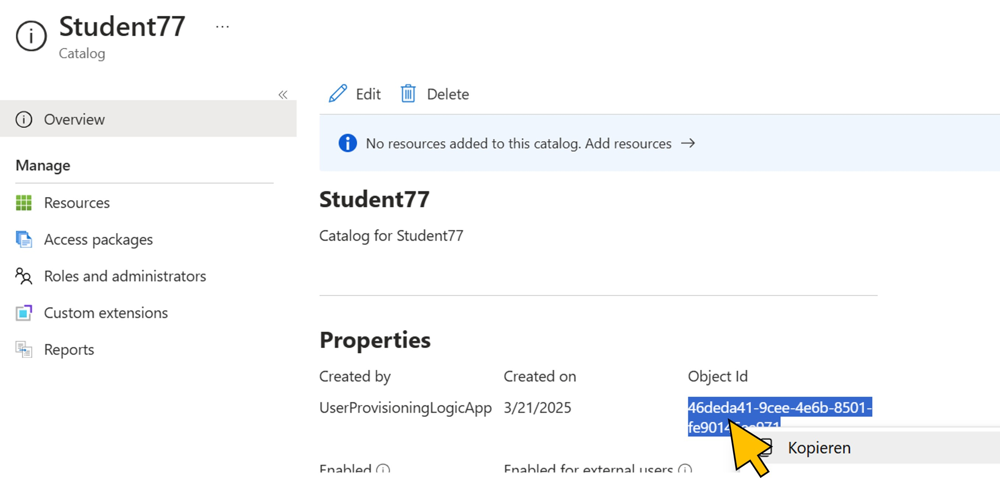</a>|
| 2.6    |Open a text editor and **paste** the catalog Id in the new text file. Provide a label for it, for example *Catalog ID:*.|<a href="./img/2-6.jpg" target="_blank">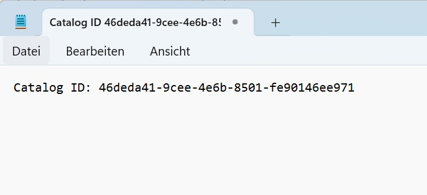</a>|
| 2.7    |Select **Custom extensions** from the navigation menu.  Click **+ Add a custom extension**.||
| 2.8    |On the first page **Basics** of the wizard, provide a name (*DynamicApprover*) and description.  Click **Next: Extension Type**.||
| 2.9    |Keep the default selection and click **Next: Extension Configuration**.||
| 2.10   |Select **Launch and wait** for the *Behaviour* of the new extension, and **Approval Stage (Preview)** for the *Response data*. Keep the expiration to 5 minutes.  Click **Next: Details**.|<a href="./img/2-10.jpg" target="_blank">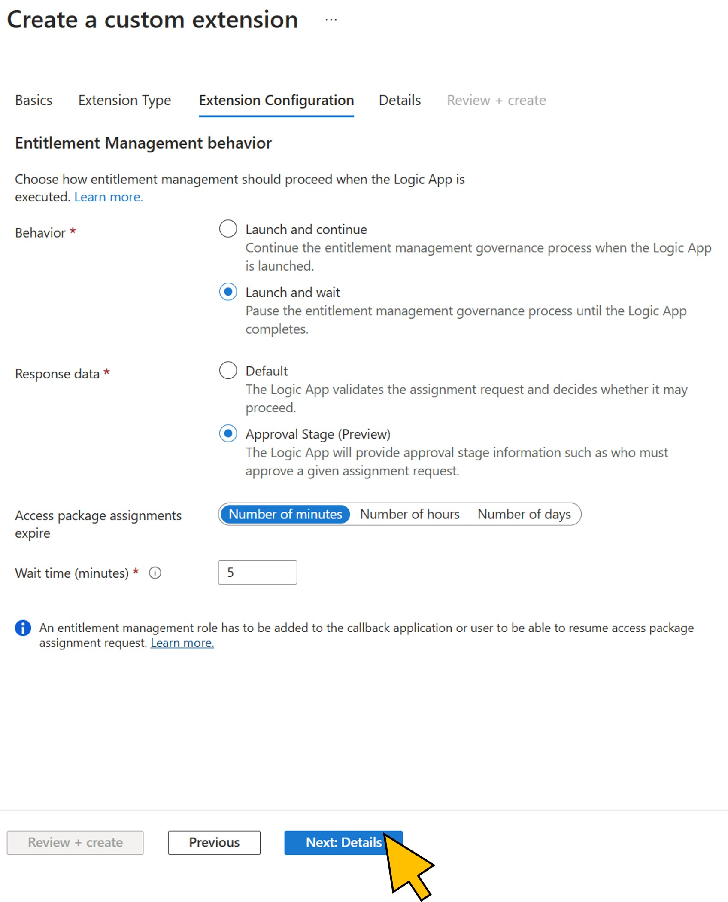</a>|
| 2.11   |Select **No** for the switch to *Create a logic app*. You will use an existing app already deployed to the Entra tenant. Select *Visual Studio Enterprise Abonnement* for the **Subscription**, *SAPEntra-RG* for the **Resource Group**, and *DynamicApprover* for the **Logic App**.  Click **Next:Review + create**.||
| 2.12   |Click **Create**.|<a href="./img/2-12.jpg" target="_blank">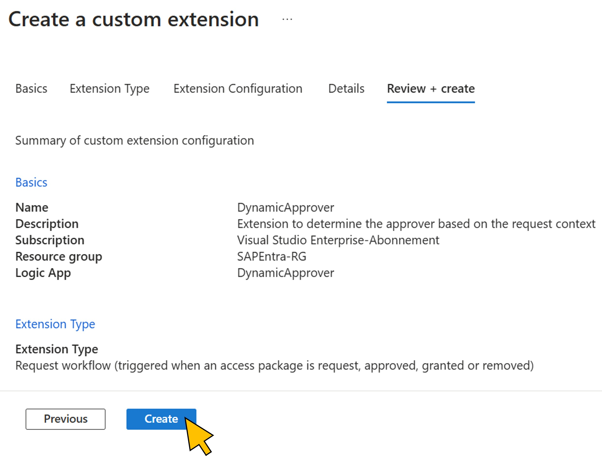</a>|
| 2.13   |Go to **Roles and administrators**.  Click **+ Add access package assignment manager**.||
| 2.14   |In the search bar, enter *DynamicApprover**. Switch to the **Enterprise applications** tab and activate the checkbox for the DynamicApprover enterprise app in the search results.  Click **Select**.||
| 2.15   |Navigate to **Access packages**.  Click **+ New access package**.||
| 2.16   |On the first page of the wizard, provide a **Name** for the new access package, e.g. *BTP Student \<41..70\>.  Enter a description and click **Next: Resource roles**.||
| 2.17   |Under **Resource roles**, click **+ Groups and Teams**.|<a href="./img/2-17.jpg" target="_blank">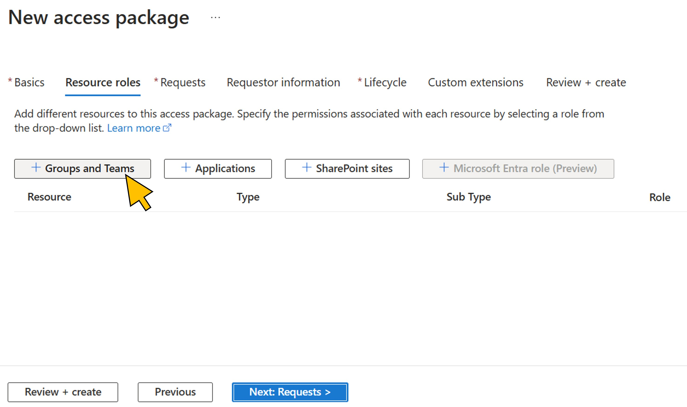</a>|
| 2.18   |Activate the **checkbox** to *see all groups*. Enter *SAP BTP* in the search field.  Activate the **checkbox** for the *SAP BTP Developer* group.  Click **Select**.||
| 2.19   |From the **Role** drop-down list, select *Member*.  Click **Next: Requests**||
| 2.20   |For now, select **None (administrator direct assignments only)** as the *Users who can request access*. This will be changed in the next exercise. Turn **Require approval**, **Disable assignment emails**, and **Enable new requests** to *No*.  Click **Next: Requestor Information**.|<a href="./img/2-20.jpg" target="_blank">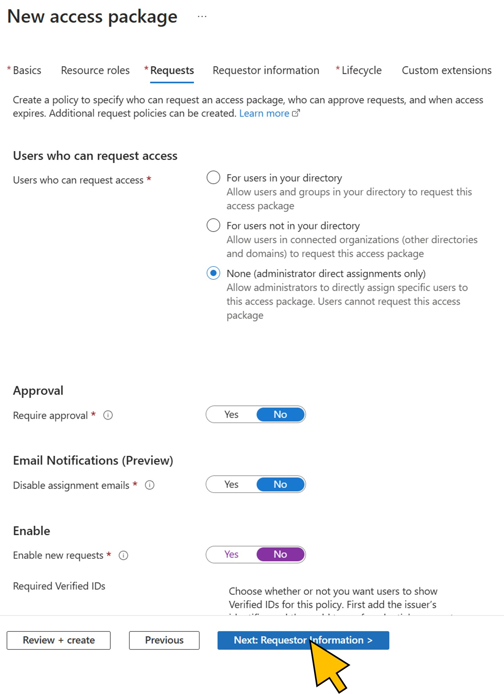</a>|
| 2.21   |Again, the details on questions and input required by the user requesting the package will be configured in the next exercise.  Click **Next: Lifecycle**.|<a href="./img/2-21.jpg" target="_blank">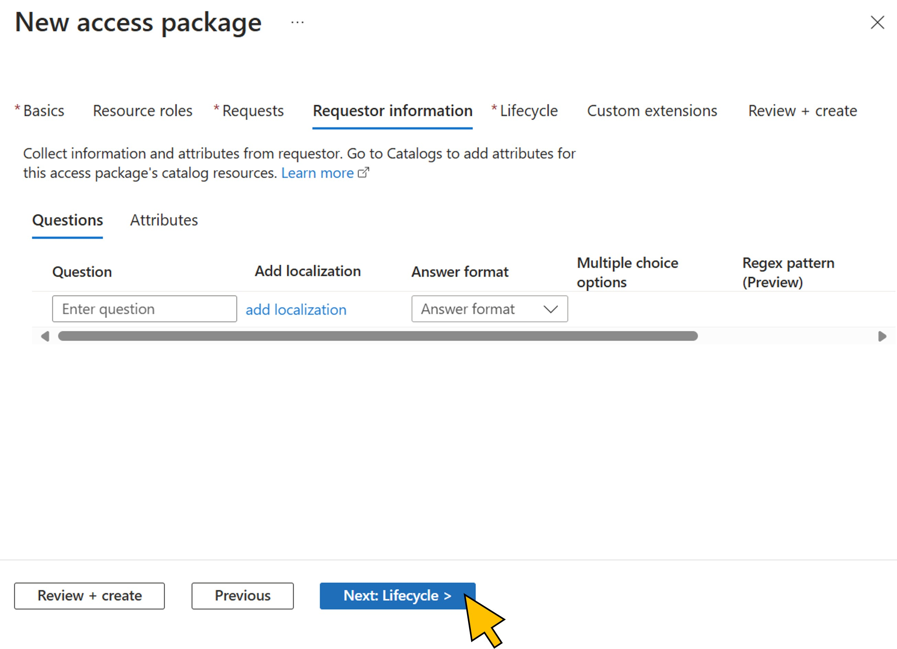</a>|
| 2.22   |Set the **Require access reviews** to *No*.  Click **Next: Rules**.|<a href="./img/2-22.jpg" target="_blank">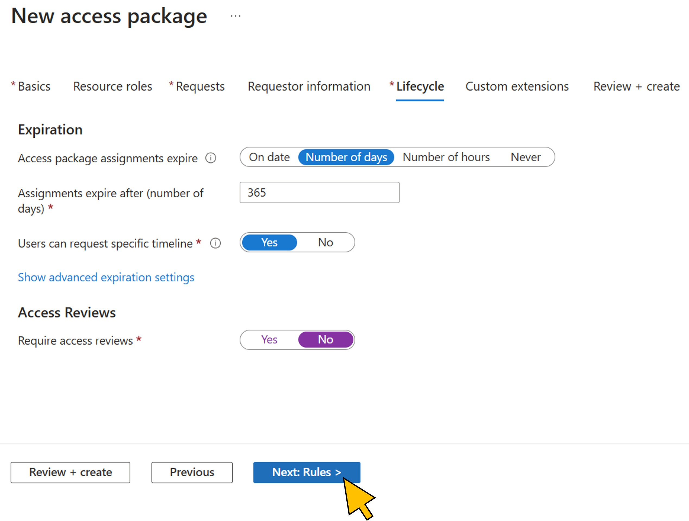</a>|
| 2.23   |Click **Next: Review + create**.|<a href="./img/2-23.jpg" target="_blank">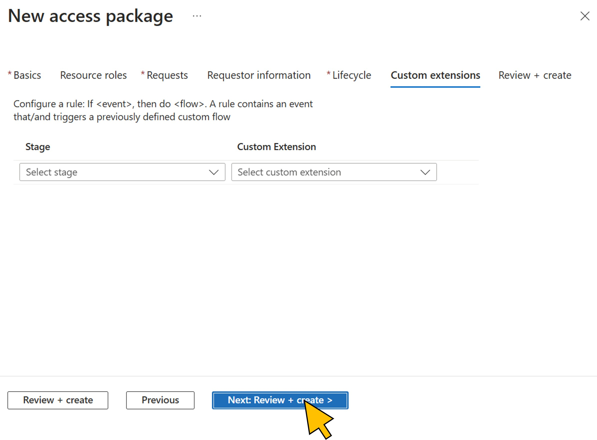</a>|
| 2.24   |Click **Create**.||
| 2.25   |Mark the **Object Id** of the new access package, **right-click**, and select **Copy** from the context menu.|<a href="./img/2-25.jpg" target="_blank">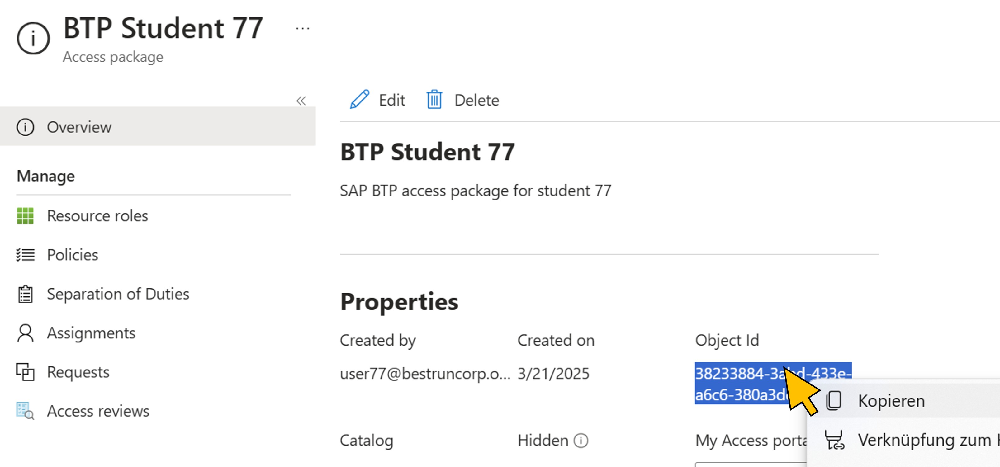</a>|
| 2.26   |Paste the value for the access package id in the text file you created ealier, and provide a label (e.g. *Access Package ID*)|<a href="./img/2-26.jpg" target="_blank">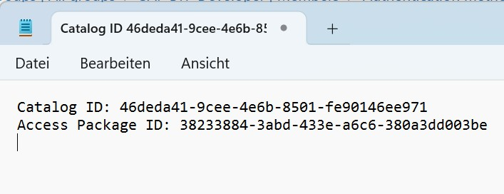</a>|

Continue with [exercise 3](../ex3/ex3.md), or go back to the [overview](../README.md).