# Exercise 3: Configure the access package assignment policy with the Microsoft Graph API
With the base access package created in the [previous exercise](../ex2/ex2.md), you will now add an assignment policy. The policy controls who can request the package and who can approve it. Since the feature for dynamic resolution of the approver with an Azure Logic App extension is still in a preview phase, you will use the Microsoft Graph Explorer to interact with the RESTful Graph API for this new feature. Once the feature is GA (general available), configuration via the Microsoft Entra Admin Center will also be possible. 

| Step   | Description     | Screenshot          |
| :----- | :-------------- | :-----------------: |
| 3.1    |Open a **new browser tab**.<br><br>Go to [Microsoft Graph Explorer](https://developer.microsoft.com/en-us/graph/graph-explorer).|<a href="./img/3-1.jpg" target="_blank">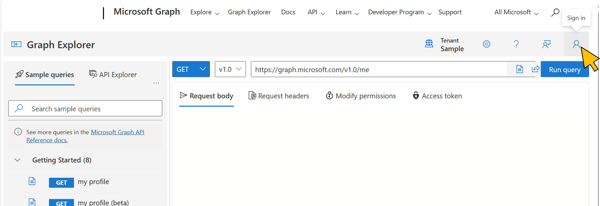</a>|
| 3.2    |Login with your user account.|<a href="./img/3-2.jpg" target="_blank"></a>|
| 3.3    |Select **Next**|<a href="./img/3-3.jpg" target="_blank">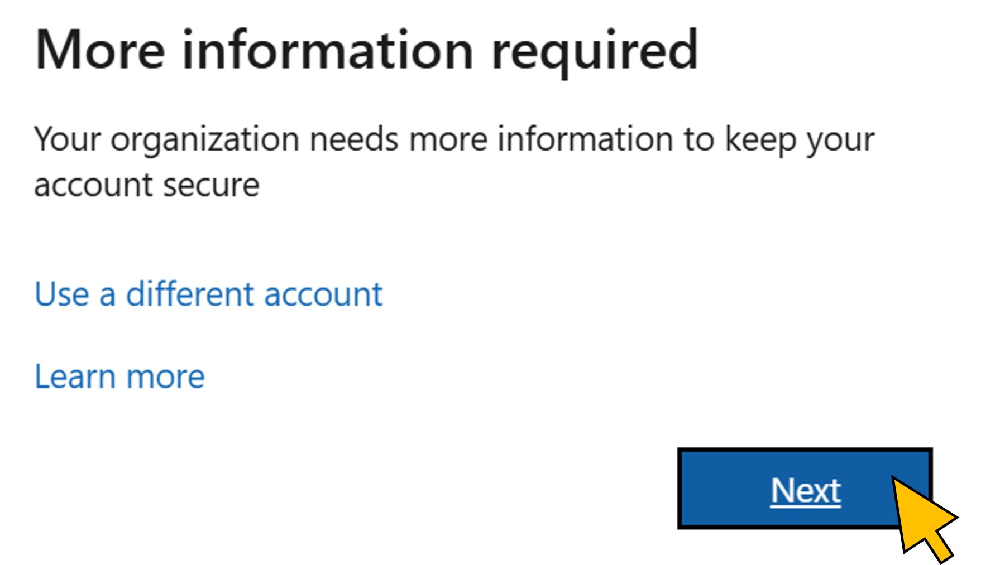</a>|
| 3.4    |Select **Done**|<a href="./img/3-4.jpg" target="_blank">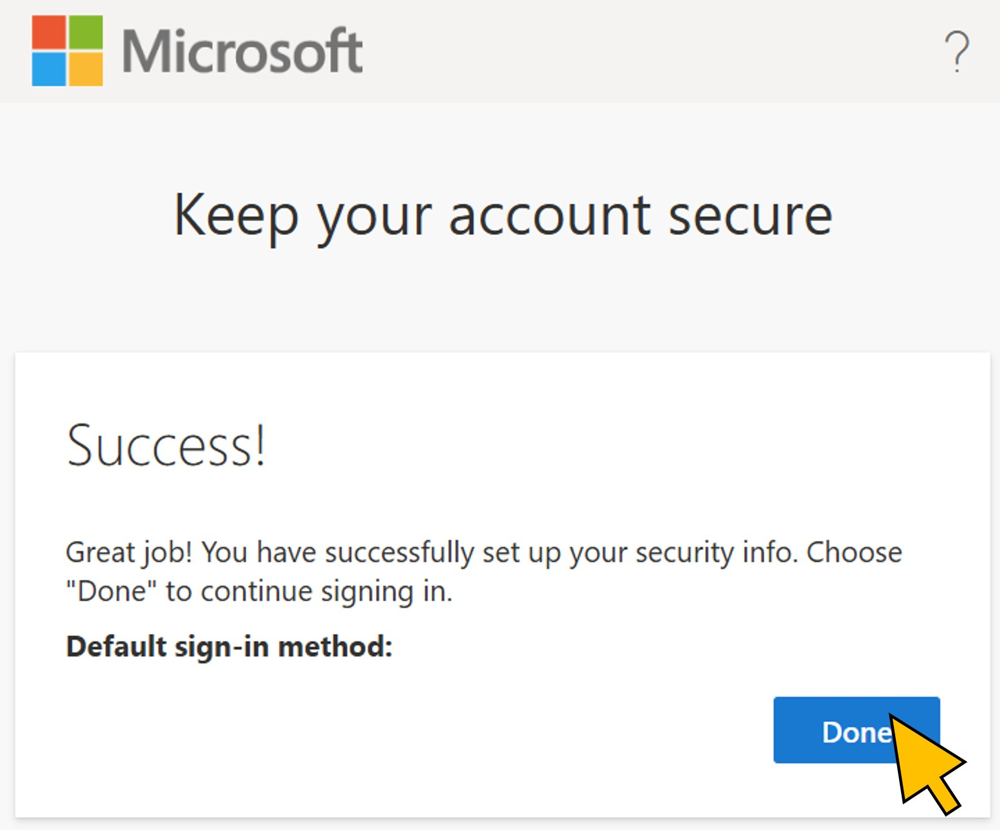</a>|
| 3.5    |Retrieve your user's data by clicking **Run query** for the Graph URL https://graph.microsoft.com/v1.0/me.|<a href="./img/3-5.jpg" target="_blank">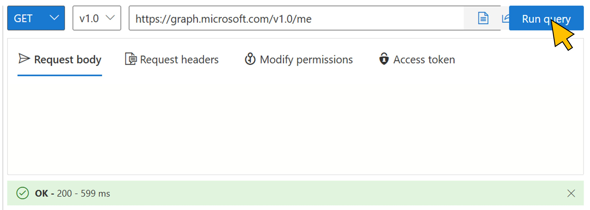</a>|
| 3.6    |In the **Response preview** tab, mark the value for the *id* element, **right-click**, and select **Copy** from the context menu.|<a href="./img/3-6.jpg" target="_blank">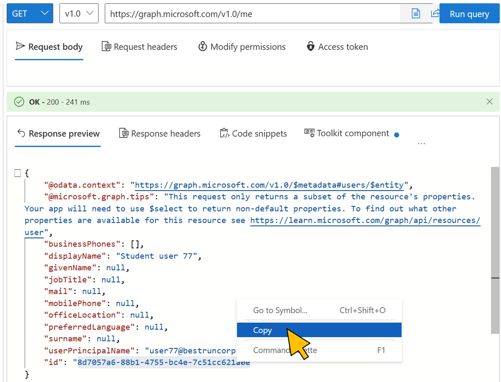</a>|
| 3.7    |Paste the user id value from the clipboard to your text file, and add a lable to it, e.g. *User ID*.|<a href="./img/3-7.jpg" target="_blank">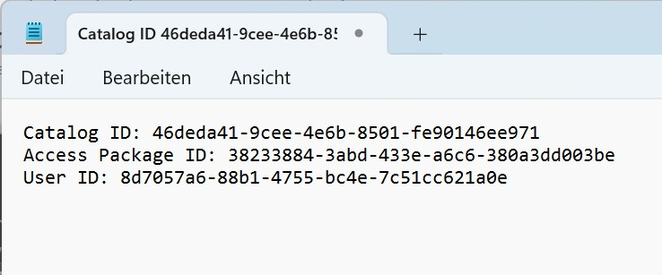</a>|
| 3.8    |Copy and paste the following URL into Graph Explorer:<br><br>```https://graph.microsoft.com/beta/identityGovernance/entitlementManagement/accessPackageCatalogs/<catalog id>/accessPackageCustomWorkflowExtensions```<br><br>Replace the *\<catalog_id\>* with the value from your text file.<br><br>Click **Run query**.|<a href="./img/3-8.jpg" target="_blank">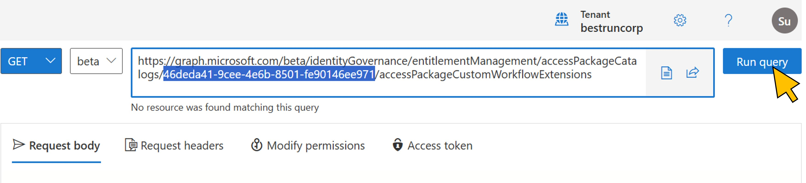</a>|
| 3.9    |From the **Response preview**, mark the *id* value, right-click, and select **Copy** from the context menu.|<a href="./img/3-9.jpg" target="_blank">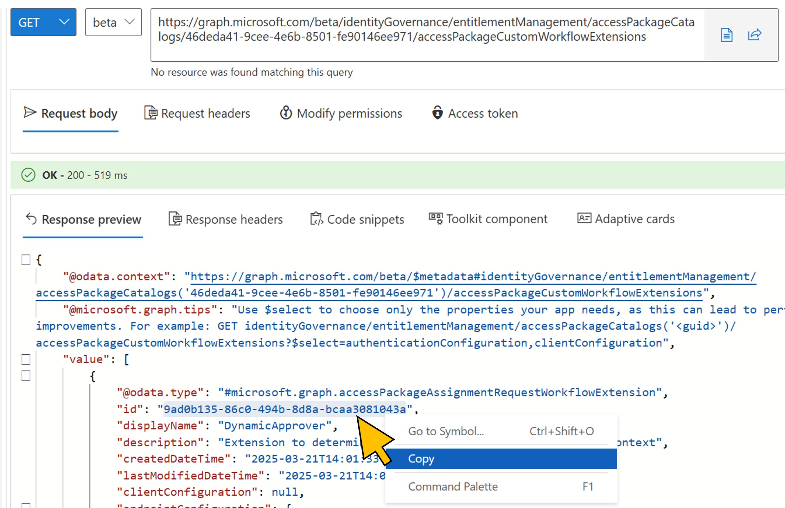</a>|
| 3.10   |Paste the value to the text file, and add a label to it, e.g. *Extension ID*.|<a href="./img/3-10.jpg" target="_blank">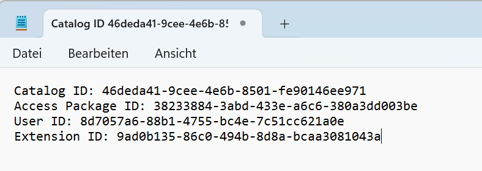</a>|
| 3.11   |Copy and paste the following URL into Graph Explorer:<br><br>```https://graph.microsoft.com/beta/identityGovernance/entitlementManagement/accessPackageAssignmentPolicies```<br><br>Change the HTTP method from *GET* to **POST**.<br><br>Switch to the **Request body** tab.|<a href="./img/3-11.jpg" target="_blank">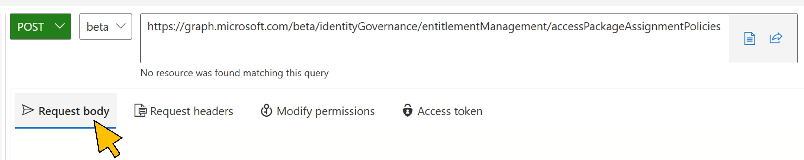</a>|
| 3.12   |Copy and paste the content from the file [accessPackageAssignmentPolicy.json](../files/accessPackageAssignmentPolicy.json) into the **Request body**.<br><br>Replace the placeholder *\<Access Package ID\>* with the corresponding value from the text file.|<a href="./img/3-12.jpg" target="_blank">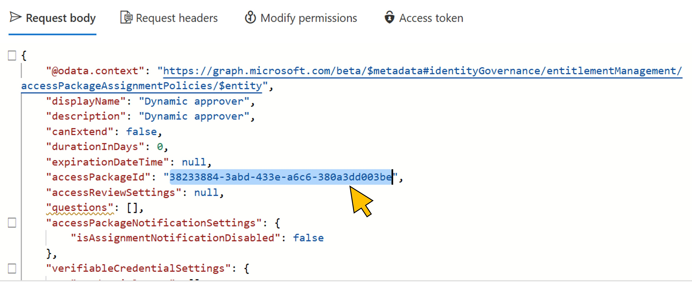</a>|
| 3.13   |Scroll down and replace the placeholder *\<User ID\>* with the corresponding value from the text file. You may also replace the placeholder *\<NN\>* with the number assigned to you.|<a href="./img/3-13.jpg" target="_blank">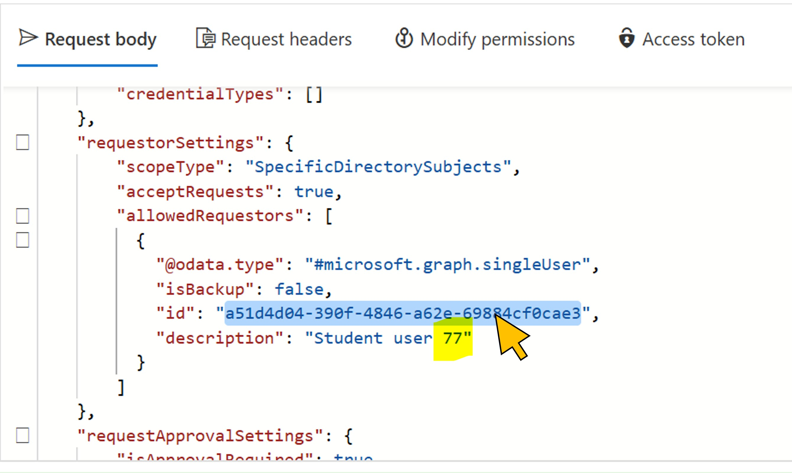</a>|
| 3.14   |Replace the *first* occurence of the placeholder *\<Extension ID\>* with the corresponding value from the text file.|<a href="./img/3-14.jpg" target="_blank">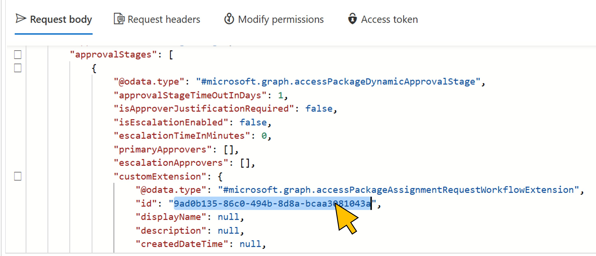</a>|
| 3.15   |Replace the *second* occurence of the placeholder *\<Extension ID\>* with the corresponding (same) value from the text file.|<a href="./img/3-15.jpg" target="_blank">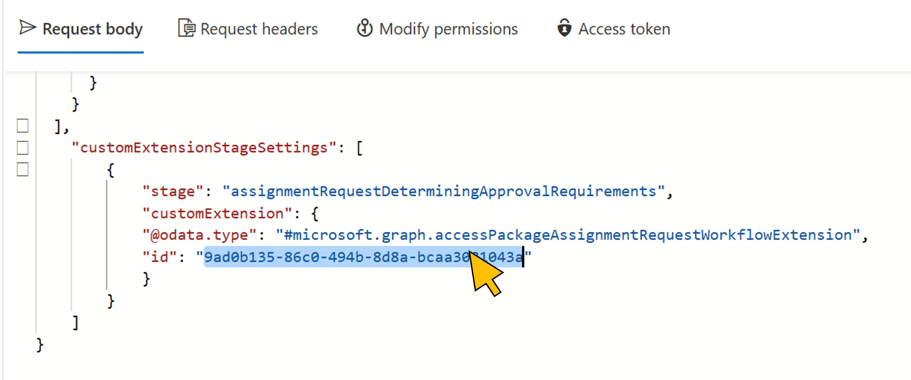</a>|
| 3.16   |Click **Run query**.<br><br>Verify that the HTTP response code from the Graph API call is **Created - 201**.|<a href="./img/3-16.jpg" target="_blank">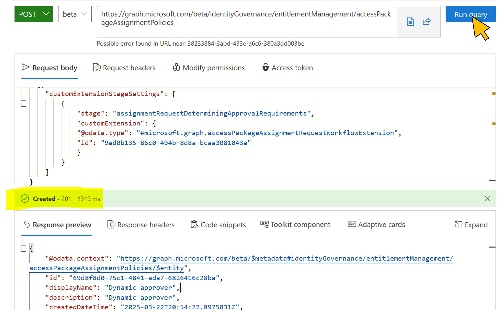</a>|
| 3.17   |Switch back to the first browser tab.<br><br>Select **Policies** from the navigation menu. Select the newly created **Dynamic approver** assignment policy from the list, and mark the value for **Policy ID** in **Policy details**.<br><br>**Right-click** and select **Copy** from the context menu.|<a href="./img/3-17.jpg" target="_blank">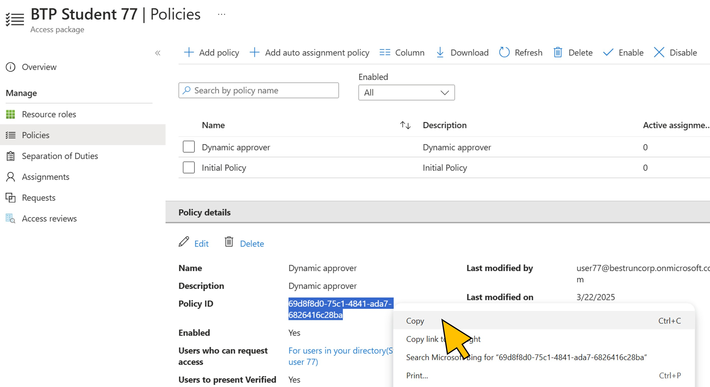</a>|
| 3.18   |Paste the value for the **Access Policy ID** in the text file, and add a label to it (e.g. *Access Policy ID*).|<a href="./img/3-18.jpg" target="_blank">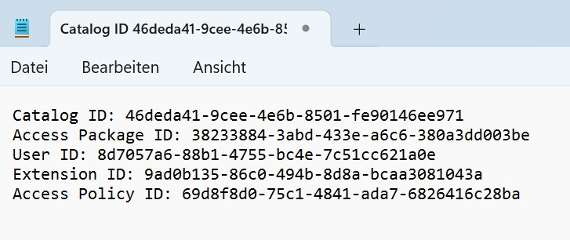</a>|
| 3.19   |To verify the dynamic approval configurion of the new policy, click on the link **Approval stage details**.|<a href="./img/3-19.jpg" target="_blank"></a>|
| 3.20   |You can see that the value for the approver is not fixed but *\"determined during assignment requests by a custom extension\"*. |<a href="./img/3-20.jpg" target="_blank">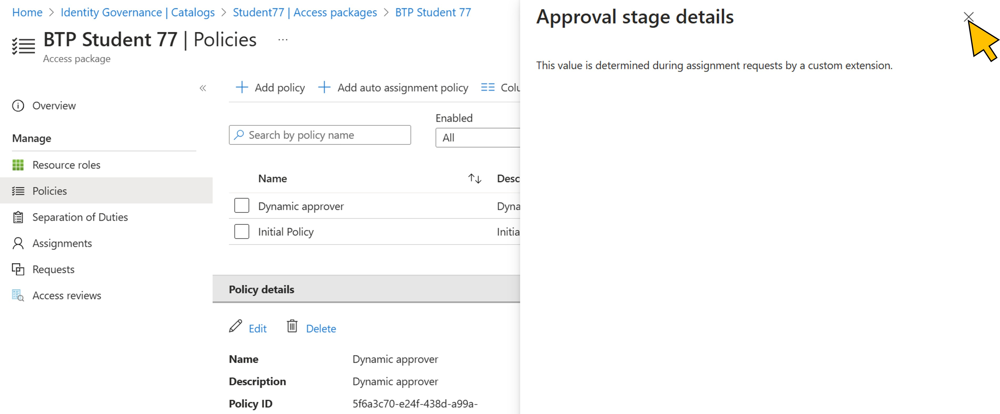</a>|

Continue with [exercise 4](../ex4/ex4.md), or go back to the [overview](../README.md).
