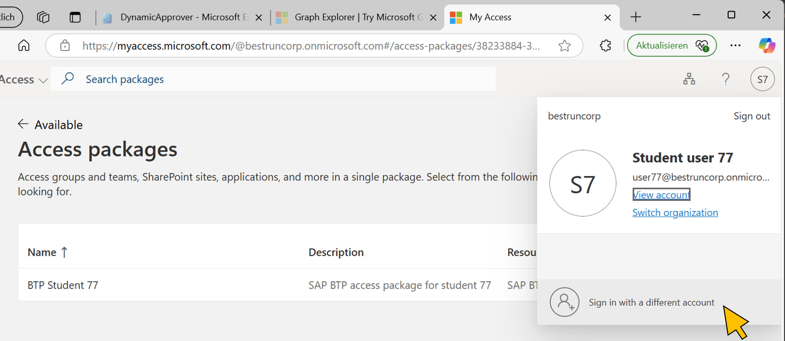
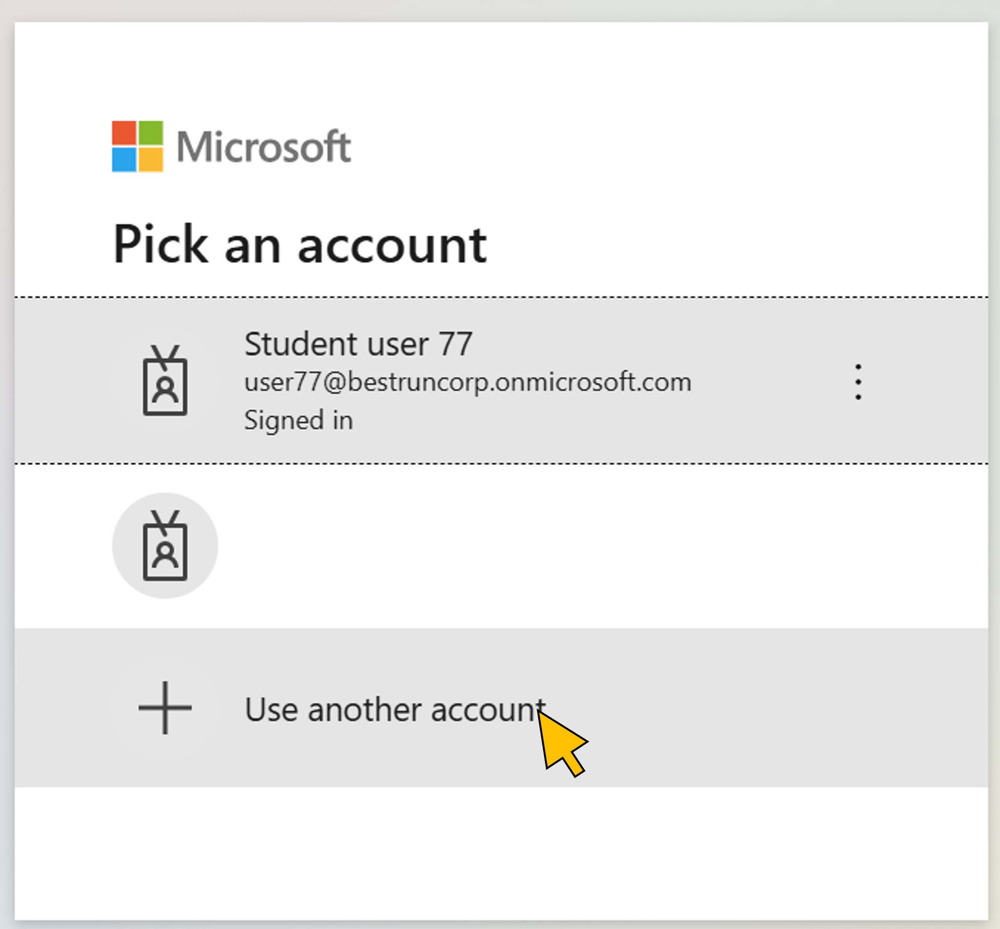
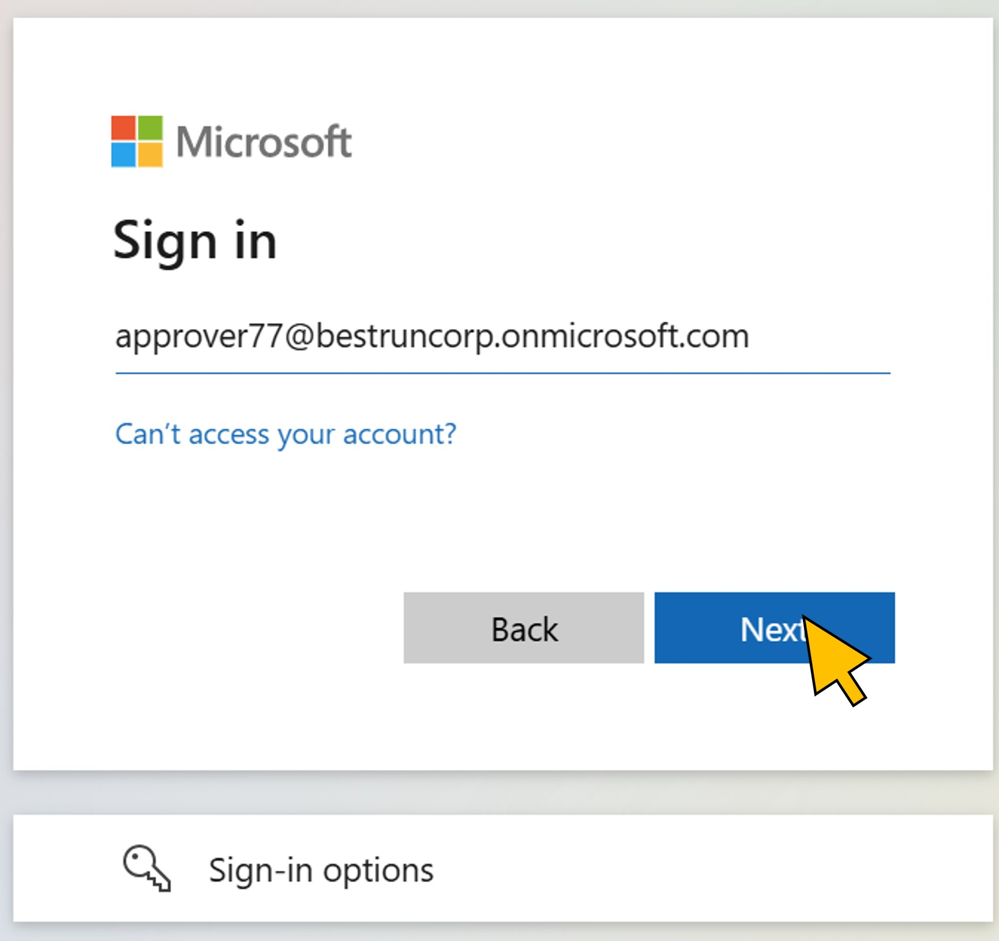
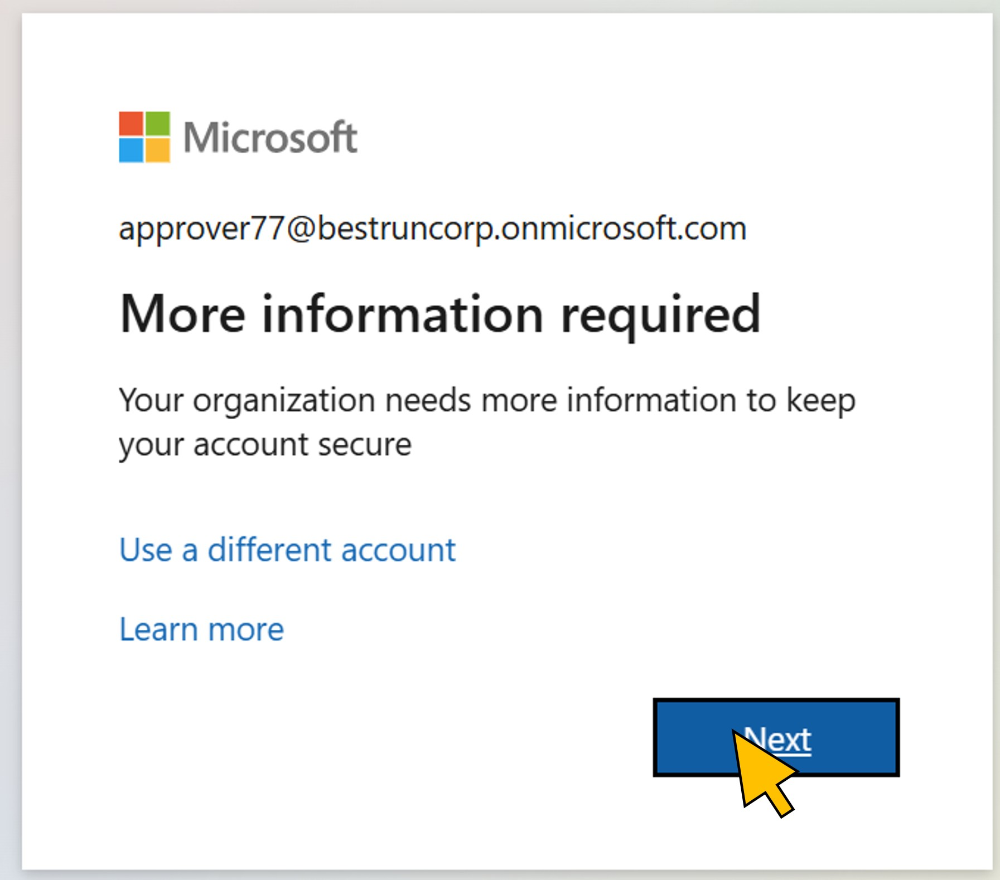
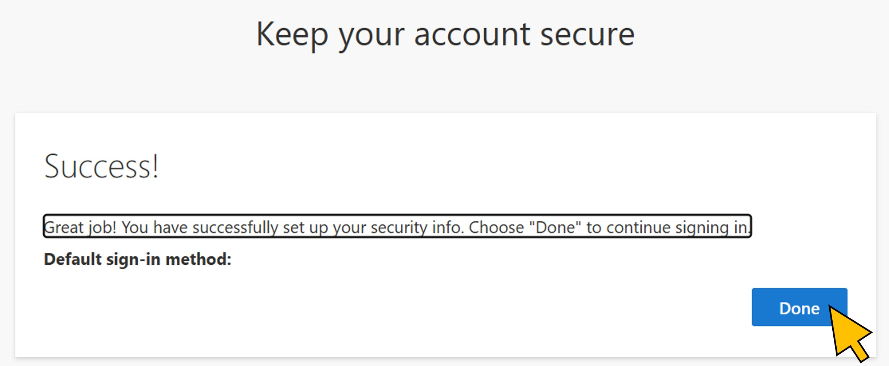
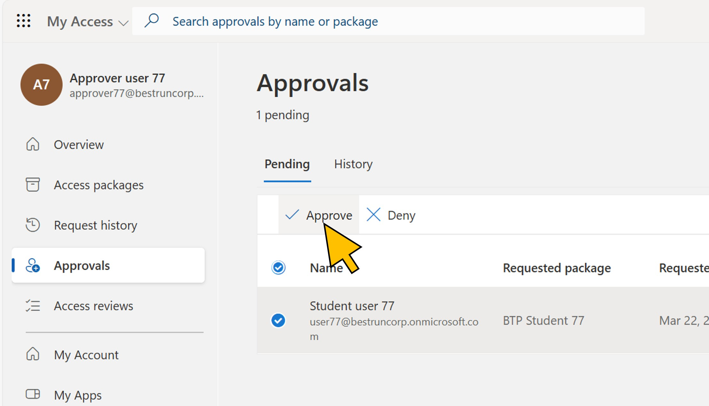
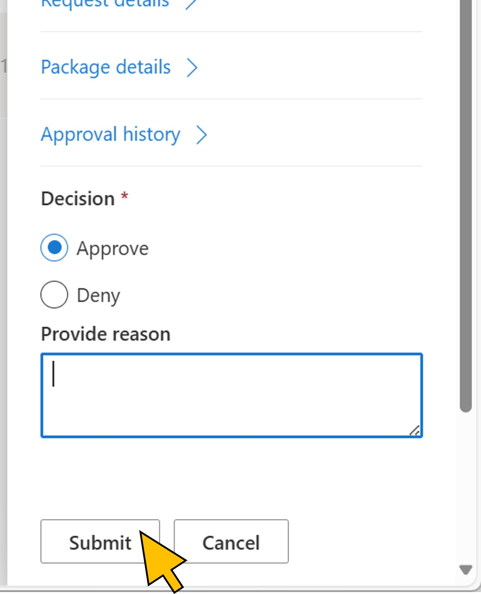

# Exercise 5: Approve the access package request
Continue testing the scenario by logging in to the *MyAccess* portal as the approver who was returned by the OData service.

| Step   | Description     | Screenshot          |
| :----- | :-------------- | :-----------------: |
| 5.1    |Open your user login and select **Sign in with a different account**.||
| 5.2    |Click **Use another account**.||
| 5.3    |Enter your approver user id (*approver\<41..70\>@bestruncorp.onmicrosoft.com*).  Click **Next**.||
| 5.4    |Click **Next**.||
| 5.5    |Click **Done**.||
| 5.6    |Select **Approvals** from the navigation.  **Activate** the checkbox on the request from your student user.  Click **Approve**.||
| 5.7    |Click **Submit**.||

Continue with [exercise 6](../ex6/ex6.md), or go back to the [overview](../README.md).