# Exercise 7 (**optional**): Inform the SOC team via Microsoft Teams
In this optional exercise, you can further enhance your skills in IAM worklow design with Entra ID Governance. To inform BestRun's Security Operations Center (SOC) team about any changes in priviledged roles such as developer access, a notification to the SOC's channel in Microsoft Teams should be send. 
You will implement this new workflow requirement with another Logic App that will be called by the correspondog events (access request approved, and access assignment removed).

| Step   | Description     | Screenshot          |
| :----- | :-------------- | :-----------------: |
| 7.1    |Go back to the first browser tab. Click **Student\<NN\> \| Custom extensions** from the breadcrumb naviation.|<a href="./img/7-1.jpg" target="_blank">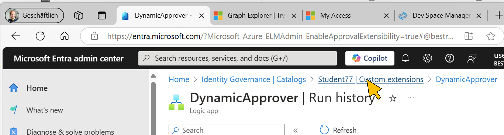</a>|
| 7.2    |Click **+ Add a custom extension**.|<a href="./img/7-2.jpg" target="_blank">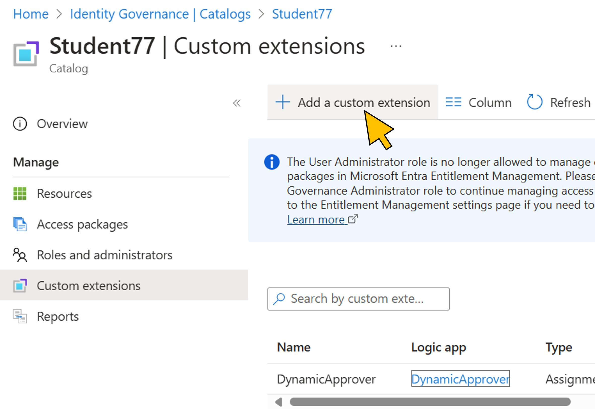</a>|
| 7.3    |Enter a name for the new extension, for example **SendTeamsNotification**, and enter a description.<br><br>Click **Next: Extension Type**.|<a href="./img/7-3.jpg" target="_blank"></a>|
| 7.4    |Select **Request workflow** for the *Extension Type*.<br><br>Click **Next: Extension Configuration**.|<a href="./img/7-4.jpg" target="_blank"></a>|
| 7.5    |Select **Launch and continue** for the *Behavior* of the new logic app.<br><br>The entitlement management governance process is not required to wait for the response from the new extension and can continue immediately.|<a href="./img/7-5.jpg" target="_blank"></a>|
| 7.6    |Leave the switch to **Yes** because you will create a new logic app for the extension. Select *Visual Studio Enterprise Abonnement* for the **Subscription**, *SAPEntra-RG* for the *Resource Group*.<br><br>Enter *SendTeamsNotification\<NN\>* as the **Logic app name**. Replace *NN* with the number you are assigned to.<br><br>Click **Create a logic app**.|<a href="./img/7-6.jpg" target="_blank"></a>|
| 7.7    |Wait for the message that your new logic app has been deployed successfully.<br><br>Click **Next: Review + create**.|<a href="./img/7-7.jpg" target="_blank">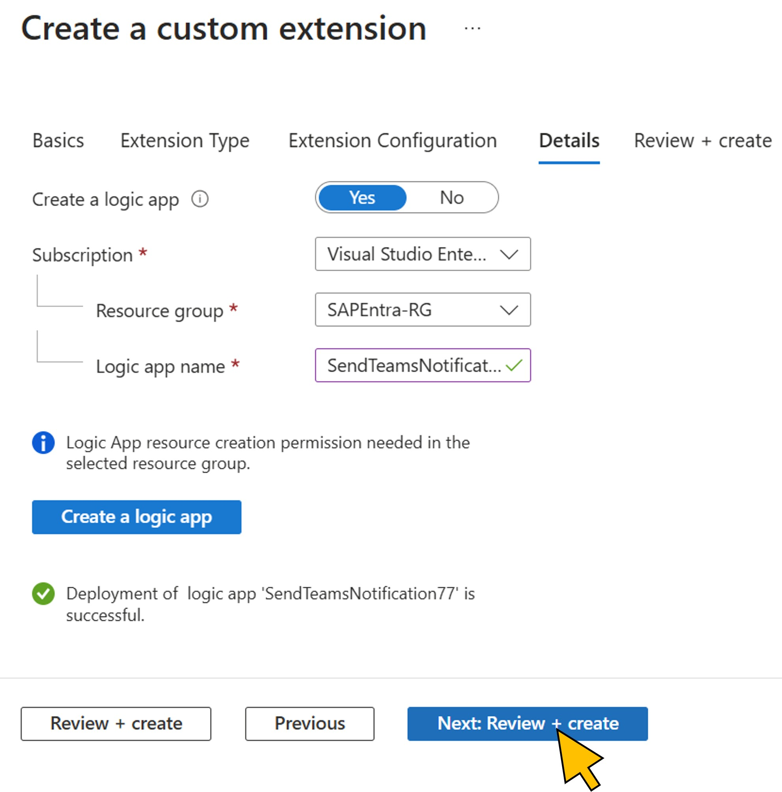</a>|
| 7.8    |Review the setting for the new custom extension, then click **Create**.|<a href="./img/7-8.jpg" target="_blank">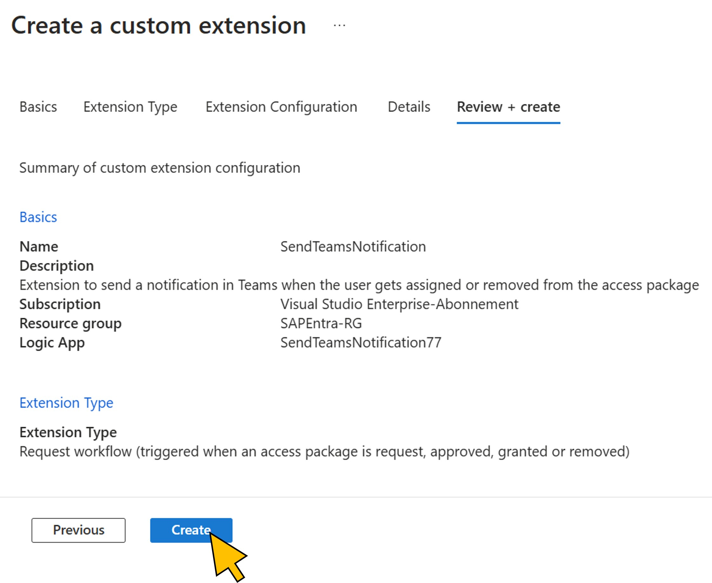</a>|
| 7.9    |From the list of custom extensions, select the newly created logic app **SendTeamsNotification\<NN\>**.|<a href="./img/7-9.jpg" target="_blank"></a>|
| 7.10   |Go to the **Logic app designer** in the navigation menue.<br><br>*Right-click** on the *Condition* action in the logic app, and select **Delete** from the context menu.|<a href="./img/7-10.jpg" target="_blank"></a>|
| 7.11   |Click **+** and select **Add an action**.|<a href="./img/7-11.jpg" target="_blank"></a>|
| 7.12   |In the *Search Bar*, filter for *Teams*.<br><br>Click the **See more** link for **Microsoft Teams** actions in the search results.|<a href="./img/7-12.jpg" target="_blank"></a>|
| 7.13   |Select the **Post *card* in a chat or channel** action from **Microsoft Teams**.|<a href="./img/7-13.jpg" target="_blank"></a>|
| 7.14   |Click **Sign in**.|<a href="./img/7-14.jpg" target="_blank">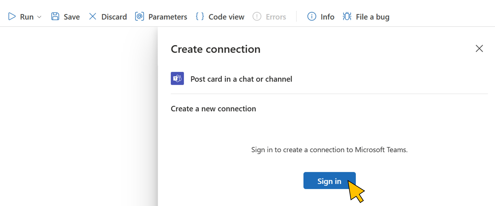</a>|
| 7.15   |Click **Use another account**.|<a href="./img/7-15.jpg" target="_blank">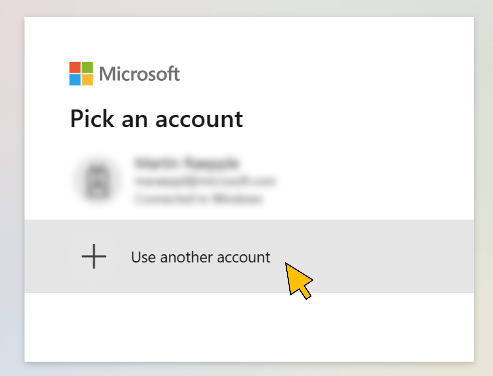</a>|
| 7.16   |Login as *sapsentinel@bestruncorp.onmicrosoft.com*.<br><br>*Note: Use the same password as for your other user accounts.*<br><br>Click **Next**.|<a href="./img/7-16.jpg" target="_blank">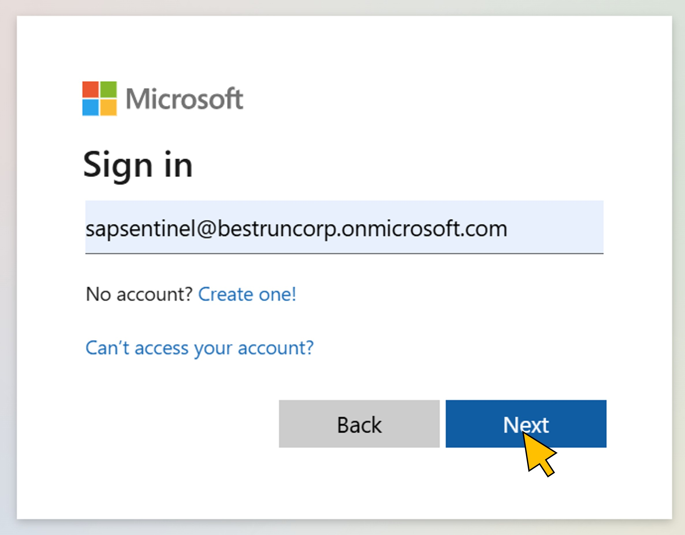</a>|
| 7.17   |Click **Next**.|<a href="./img/7-17.jpg" target="_blank">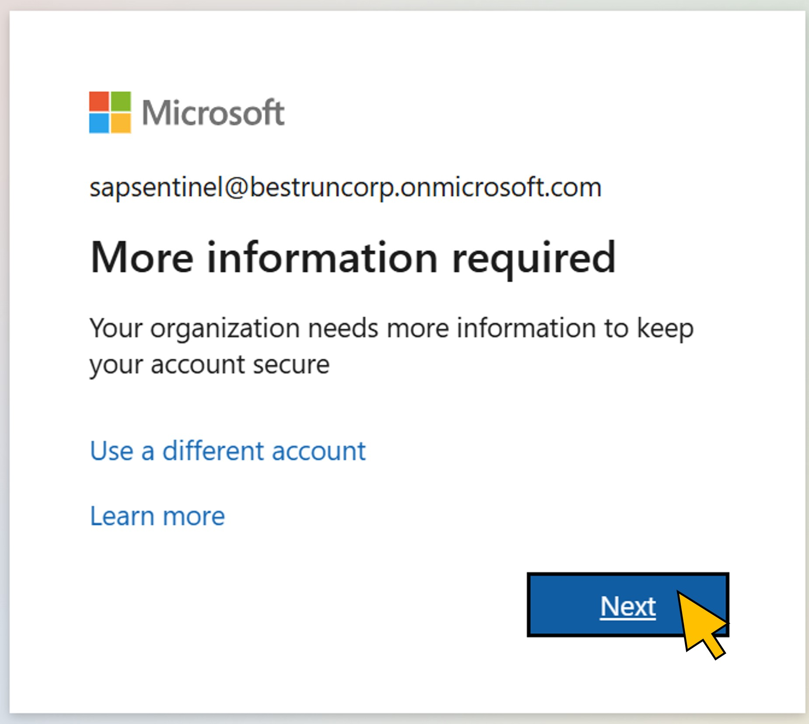</a>|
| 7.18   |Select the **SAP Sentinel** account from the list.|<a href="./img/7-18.jpg" target="_blank">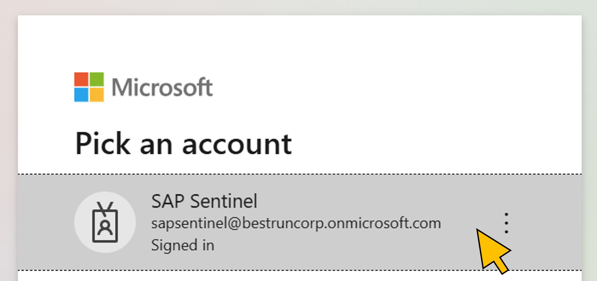</a>|
| 7.19   |Click **Continue**.|<a href="./img/7-19.jpg" target="_blank">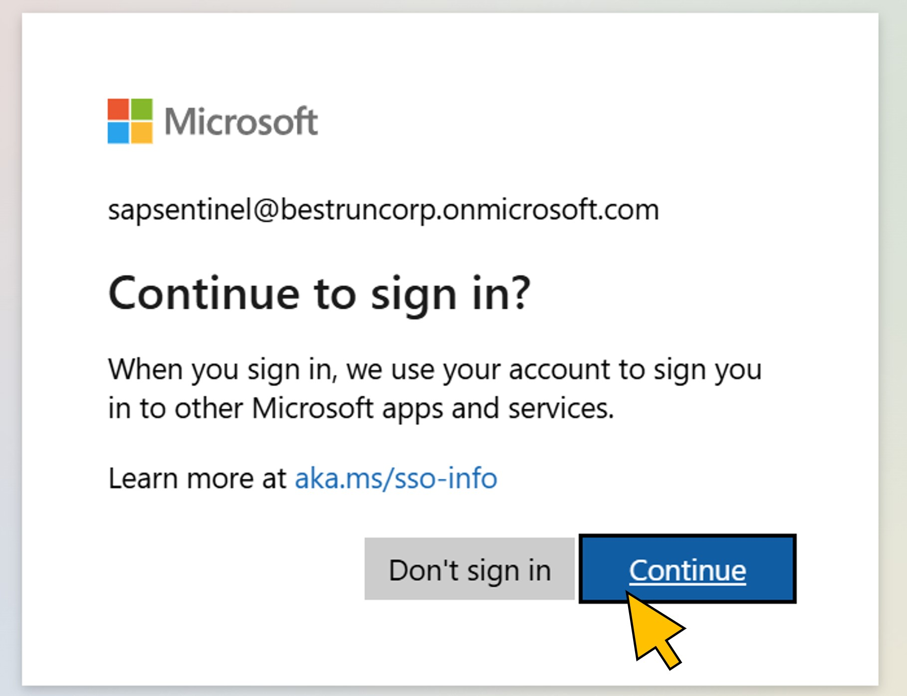</a>|
| 7.20   |Click **Skip setup**.|<a href="./img/7-20.jpg" target="_blank">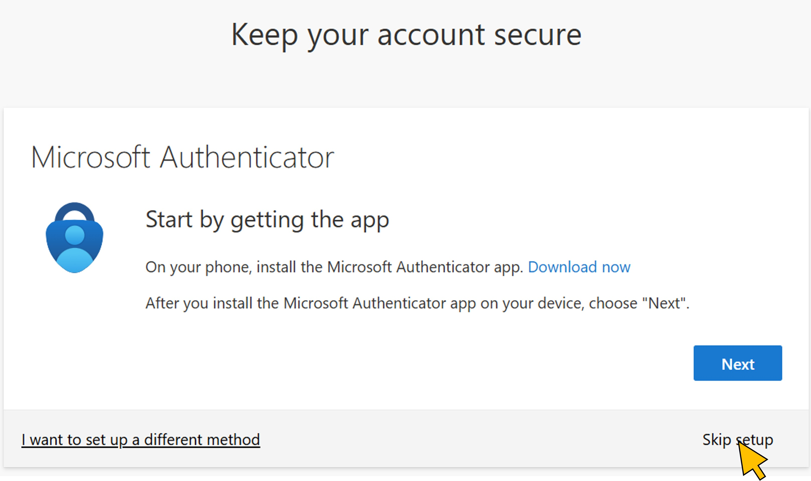</a>|
| 7.21   |Click **Yes**.|<a href="./img/7-21.jpg" target="_blank">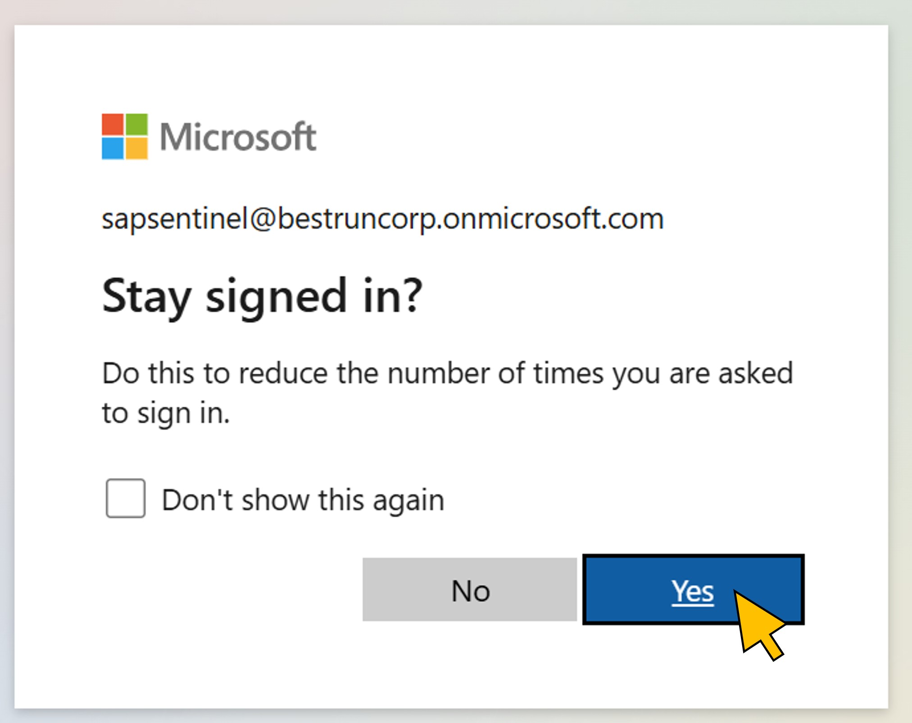</a>|
| 7.22   |Click on the title and change it, for example *Post notification in SAP IAM Events channel*.<br><br>Select **Channel** from the **Post In** drop-down list.|<a href="./img/7-22.jpg" target="_blank"></a>|
| 7.23   |Select **SAP IAM Events** from the **Channels** drop-down list.|<a href="./img/7-23.jpg" target="_blank">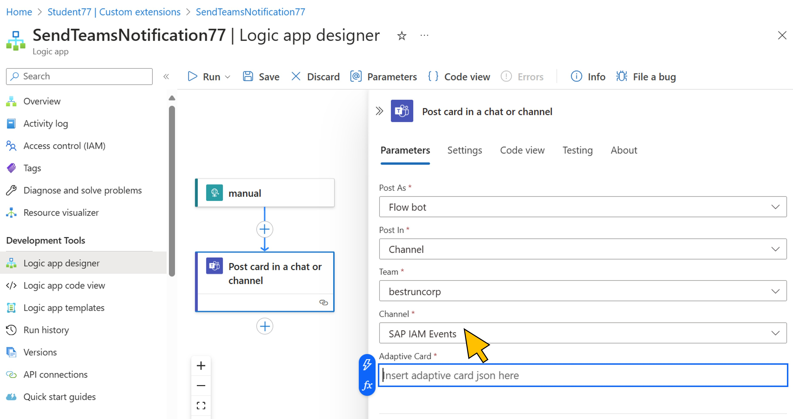</a>|
| 7.24   |In the **Adaptive Card** entry field, copy and past the content from the file [teamsAdaptiveCard.json](../files/teamsAdaptiveCard.json).<br><br>This [*Adaptive Card*](https://adaptivecards.io/) template takes the values received from the **manual** trigger event, such as the name of the access package or the user name, and sends this information nicely rendered to the selected Teams channel.|<a href="./img/7-24.jpg" target="_blank"></a>|
| 7.25   |Open a new browser tab. Go to [Microsoft Graph Explorer](https://developer.microsoft.com/en-us/graph/graph-explorer)<br><br>(Re)-run the same Graph API query from step 3.8: ```https://graph.microsoft.com/beta/identityGovernance/entitlementManagement/accessPackageCatalogs/<catalog id>/accessPackageCustomWorkflowExtensions```<br><br>Replace the placeholder for *\<catalog id\>* with the corresponding value from the text file.<br><br>Click **Run query**.|<a href="./img/7-25.jpg" target="_blank">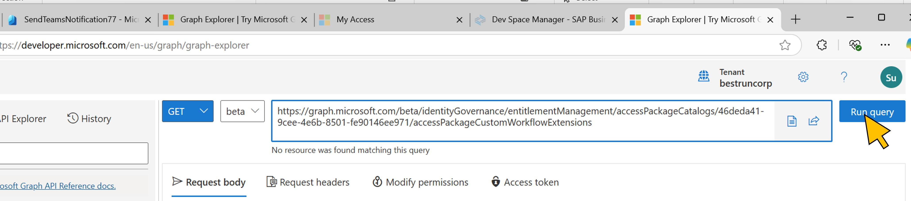</a>|
| 7.26   |From the list of custom extensions returned by Graph, mark the value for *id* for the *SendTeamsNotification* extension.<br><br>**Right-click** on the id value and select **Copy** from the context menu.|<a href="./img/7-26.jpg" target="_blank">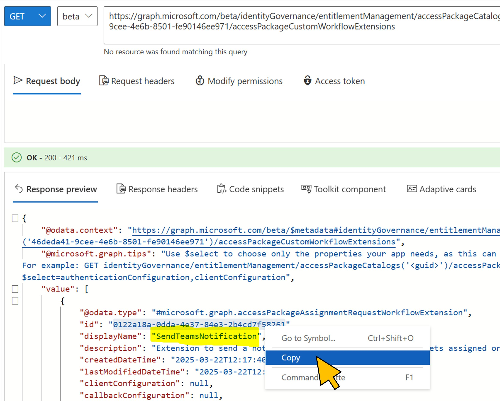</a>|
| 7.27   |Paste the value in the text file and add a label to it, e.g. *Teams Extension ID*.|<a href="./img/7-27.jpg" target="_blank">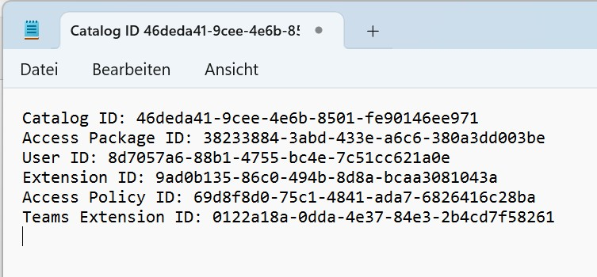</a>|
| 7.28   |Go back to the second browser tab you opened in step 3.1.<br><br>Change the request you made to create the assignment policy in the **Request body** tab. Copy the context from the file [accessPackageAssignmentPolicyUpdate.json](../files/accessPackageAssignmentPolicyUpdate.json) at the end of the existing **customExtensionsStateSettings* array element.<br><br>**Note:** With this update you've registered the new logic app custom extensions for *two* events: When a new request gets approved (*assignmentRequestApproved*), and when an existing assignment gets removed from the user (assignmentRequestRemoved). For testing the new extension you will generate an *assignmentRequestRemoved* event.|<a href="./img/7-28.jpg" target="_blank">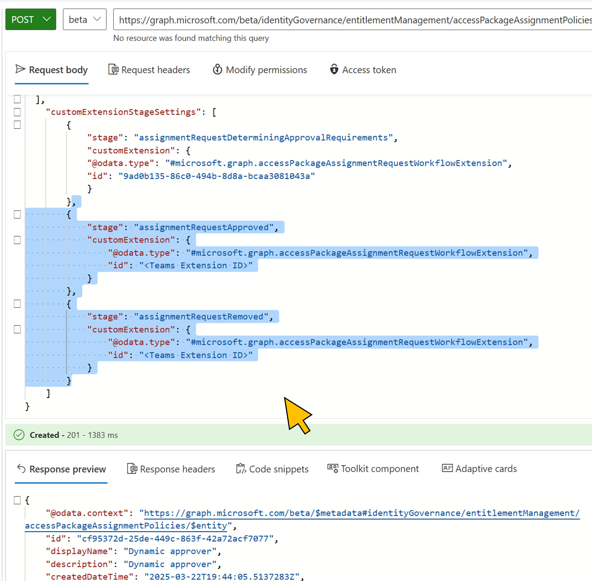</a>|
| 7.29   |Change the HTTP method from *POST* to **PUT**.<br><br>Append a **\"/\"** to the URL, followed by the value for *Access Policy ID* from the text file.<br><br>Click **Run query**.|<a href="./img/7-29.jpg" target="_blank">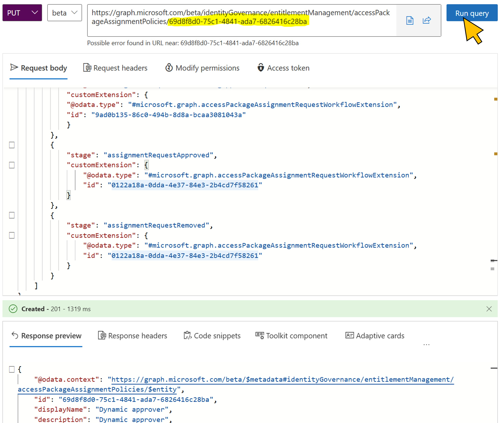</a>|
| 7.30   |Check the HTTP response code is *OK - 200*. The *Dynamic Approver* assignment policy has been updated successfully.|<a href="./img/7-30.jpg" target="_blank">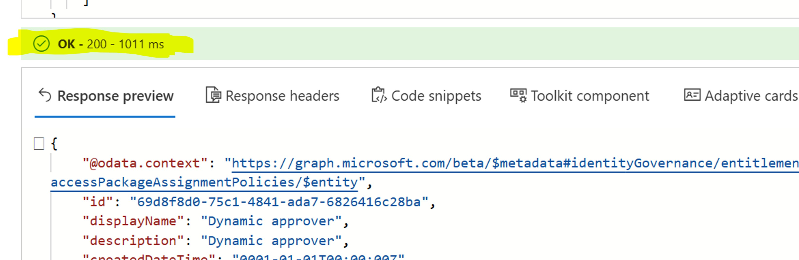</a>|
| 7.31   |Switch to the first browser tab. Select **Student\<NN\> \| Custom Extensions** from the breadcrumb navigation.|<a href="./img/7-31.jpg" target="_blank">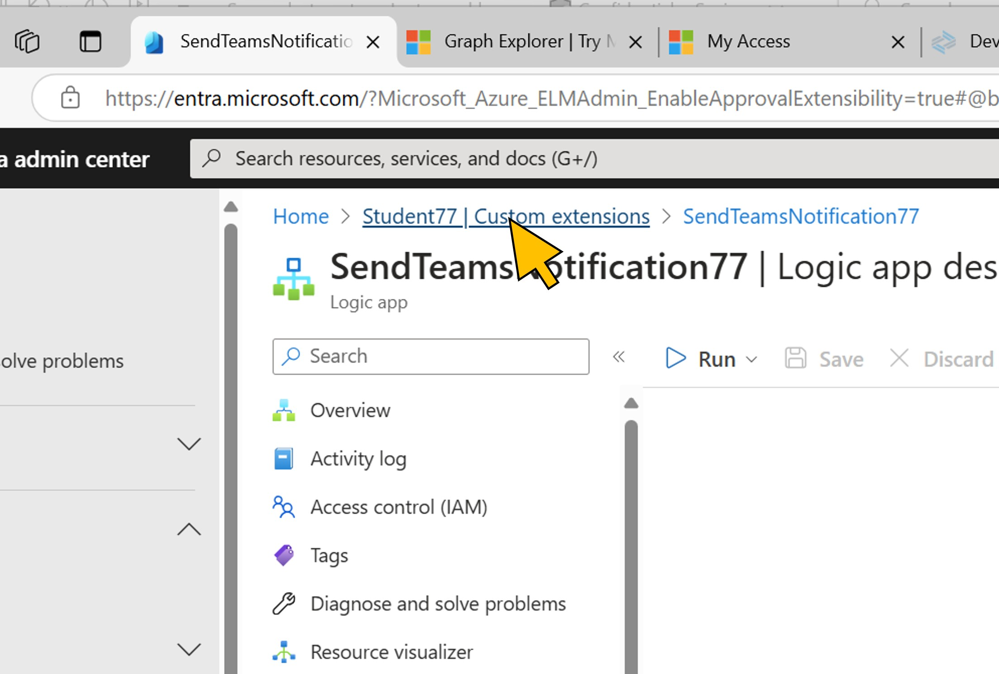</a>|
| 7.32   |Select **Access packages** from the navigation menu. Select the **BTP Student \<NN\>** package from the list.|<a href="./img/7-32.jpg" target="_blank">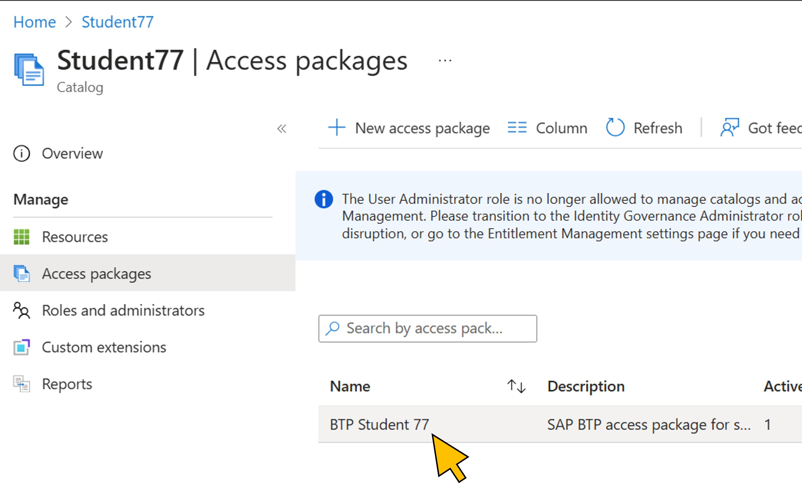</a>|
| 7.33   |Select **Assignments** from the navigation menu.<br><br>Activate the checkbox for the existing assignment to your *Student user \<NN\>*.<br><br>Click **Remove**. This will trigger the new logic app to send a notification into the SOC team's event channel.|<a href="./img/7-33.jpg" target="_blank">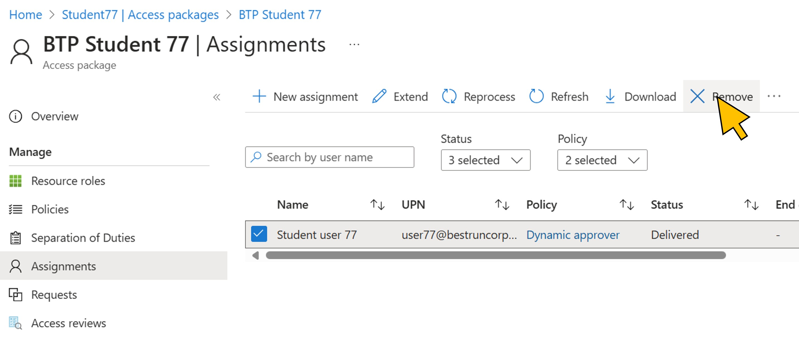</a>|
| 7.34   |Verify that the event information has been sent. Login to [Microsoft Teams}(https://teams.microsoft.com/) with user *sapsentinel@bestruncorp.onmicrosoft.com*.<br><br>Click **Next**.|<a href="./img/7-34.jpg" target="_blank"></a>|
| 7.35   |Click **Skip setup**.|<a href="./img/7-35.jpg" target="_blank"></a>|
| 7.36   |In Microsoft Teams, switch to **Teams** on the left-side navigation. Expand the *bestruncorp* team, and select the **SAP IAM Events** channel from it.<br><br>Verify that the adaptive card has been sent by your new custom extension and informs about the removal of the assignment.|<a href="./img/7-36.jpg" target="_blank"></a>|
