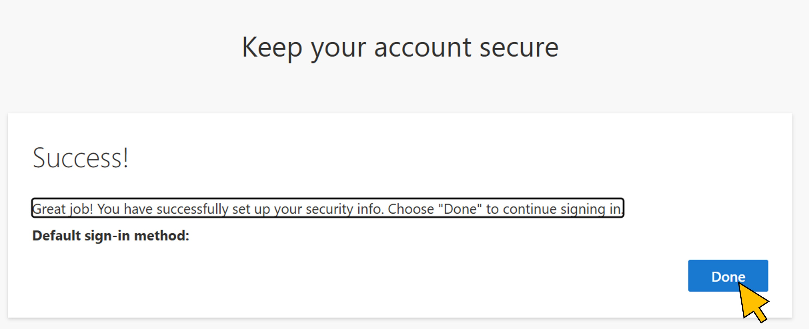
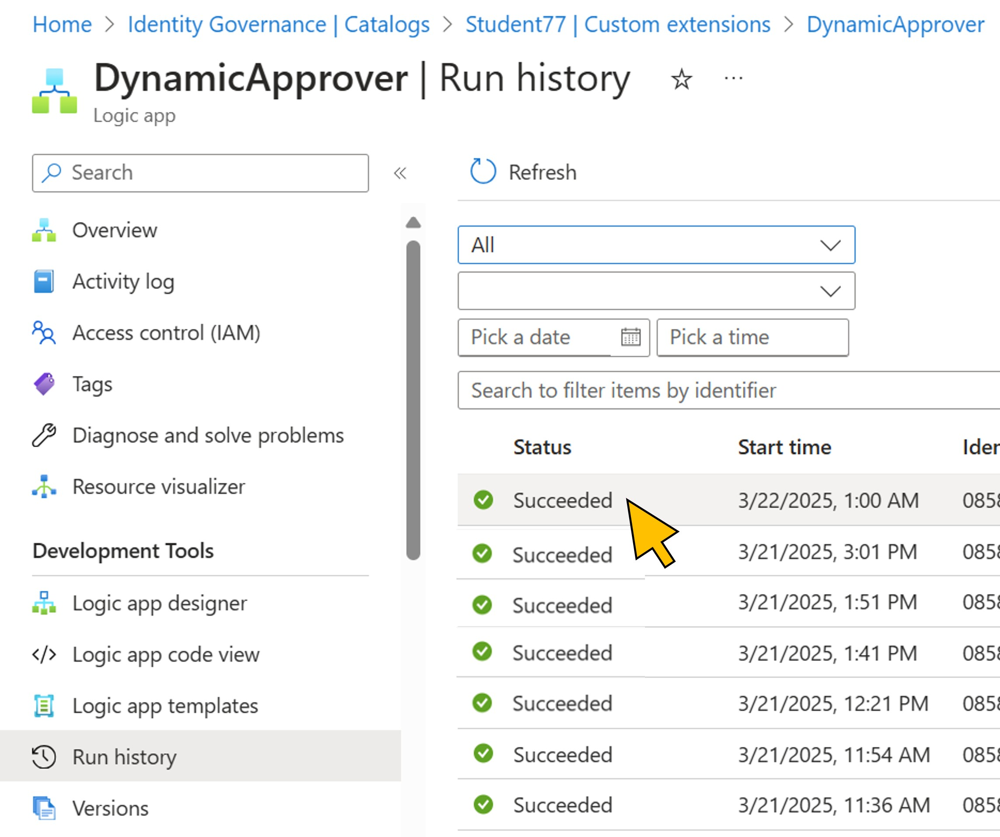
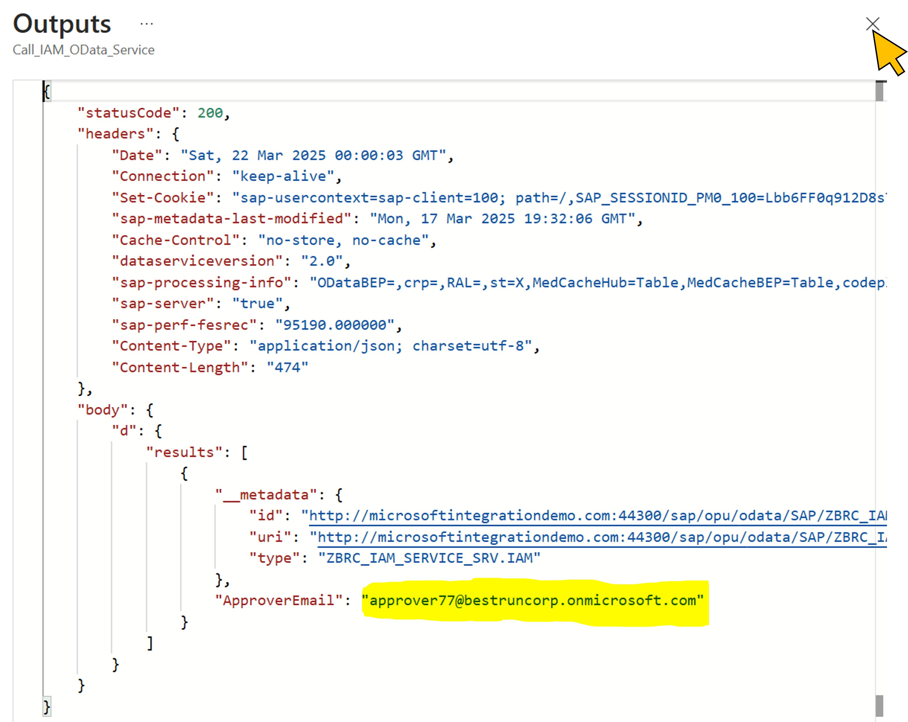

# Exercise 4: Test the new dynamic approval workflow
You are now ready to test the approval workflow by initiating a new request for the access package. You will also verify the execution of the *DynamicApprover* Logic App and the response from
the IAM OData service in S/4 HANA by using the available monitoring and troubleshooting tools.  

| Step   | Description     | Screenshot          |
| :----- | :-------------- | :-----------------: |
| 4.1    |Select **Overview** from the navigation menu.  Click **Copy to clipboard** for the *My Access portal link*.||
| 4.2    |Open a new browser tab.  Paste the *My Access portal URL** into the address bar and hit enter.  Login with user\<41..70\>@bestruncorp.onmicrosoft.com.  Click **Next**.||
| 4.3    |Select your user from the list.||
| 4.4    |Confirm with **Done**.||
| 4.5    |Click **Continue** for starting a new request for the *BTP Student \<NN\>* access package.||
| 4.6    |Provide the answers to the questions as defined in the *Dynamic approver* policy.  * Select *SAP BTP* for **Developer role**. * Select *JAVA* or *SAPUI5* for **Context**. * Enter ***DE***, followed by the ***number*** you are assigned to (41..70), for **Company Code**. * Provide a *Business justification*.  Click **Submit request**.||
| 4.7    |Wait until your new request has been processed.||
| 4.8    |Go back to the first browser tab.   Select **Identity Governance \| Catalogs** from the breadcrumb navigation.||
| 4.9    |Select **Catalogs** from the navigation menu. Enter *Student*, followed by the ***number*** you are assigned to (41..70).  Click on your **catalog** in the search results.||
| 4.10   |Select **Custom extensions** from the navigation menu.  Click on the link **DynamicApprover** to navigate to the *Logic app* extension.||
| 4.11   |Select **Run history** from the **DynamicApprover** logic app navigation menu.||
| 4.12   |Click on the most recent entry from the list of runs.||
| 4.13   |The execution history of the selected run is shown.  Click the **Get company code from request** action which extracts the company code entered by the user in the request from the input values passed to the logic app.  On the right panel you can see the value entered by the user. Verify that this is the same value you entered when you've created the request.  *Note: You may have selected a run of another student in the previous step. In this case, go back an try again with another entry from the list.*||
| 4.14   |Click the **Call IAM OData Service** action from the run history. On the **OUTPUTS** section, click **Show raw outputs** to view the raw response data from the IAM OData service in S/4 HANA.||
| 4.15   |Verify that the returned value for **ApproverEmail** corresponds to the account with your number for your approver user, i.e. *approver\<41..70\>@bestruncorp.onmicrosoft.com*.||

Continue with [exercise 5](../ex5/ex5.md), or go back to the [overview](../README.md).